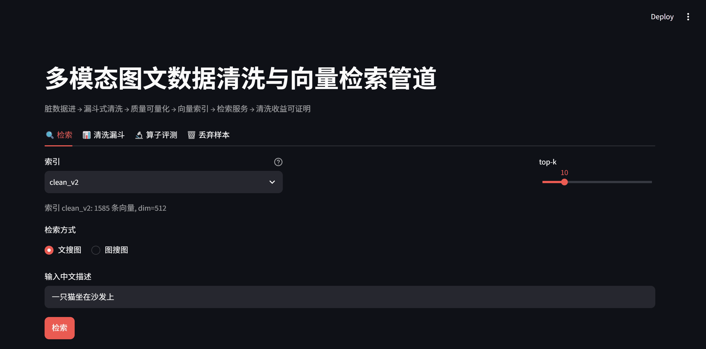
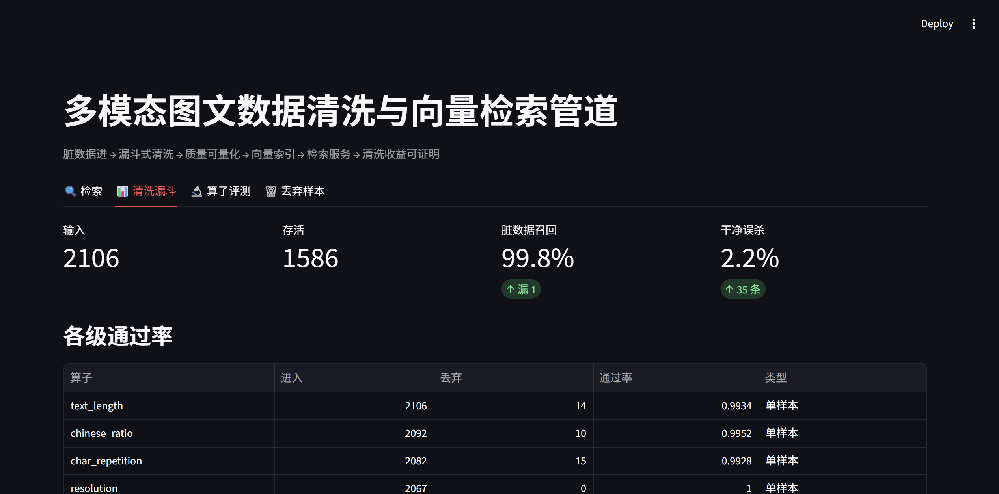
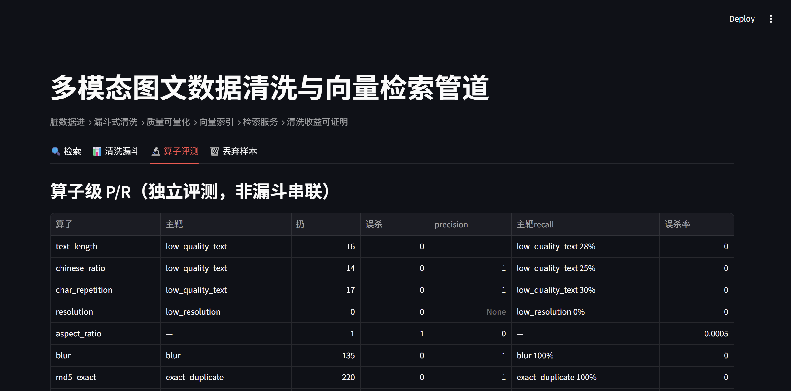
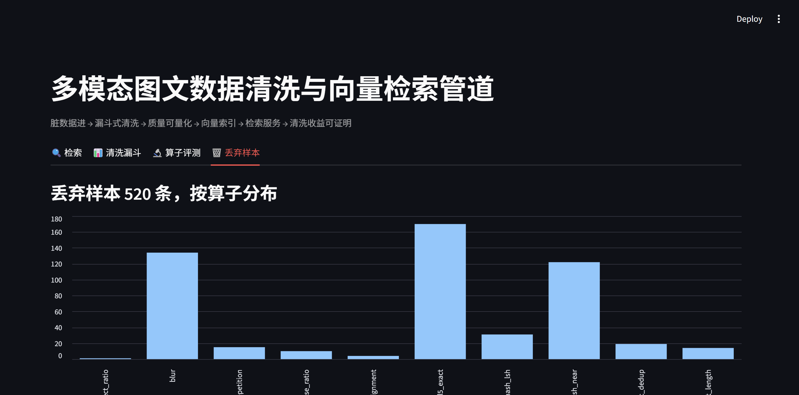

# 脏数据 → 可信训练数据：一条能被第三方复跑的 AI 数据工程链路

> **一句话**：把真实爬取的脏数据变成带血缘、带质量证据、可被下游直接消费的数据集——
> 中间每一道闸门都不是「我说了算」，它有一份注册表、一条红绿命令、一条失败归因。
>
> **面向岗位**：AI 数据开发 / AI 数据工程 / 数据平台开发（调研见 [JD_RESEARCH](docs/JD_RESEARCH.md)）。
> **判据**（下面每一项都能被追问到底，见 [PROOF_CHAIN](docs/PROOF_CHAIN.md)）。

[](https://github.com/quannie255-star/mm-curation-pipeline/actions/workflows/ci.yml)
[](https://github.com/quannie255-star/mm-curation-pipeline/actions/workflows/data-ci.yml)
[](LICENSE)
[](https://www.python.org/downloads/)

> **想先看结论再读代码？** → [产品页（单页自包含）](docs/product.html)：
> 三十秒结论 + 每个数字的出处 + **诚实边界** + 自己验一遍的三条命令。
> 页面数字不手写——由 [`docs/claims.json`](docs/claims.json) 现算，页面对不上注册表就**生成失败**。

## 自己验一遍（三条命令，不用 GPU、不用下载数据）

```bash
git clone https://github.com/quannie255-star/mm-curation-pipeline && cd mm-curation-pipeline

# ① 对外数字都锁在注册表里：文档/前端的字面量对不上来源就红
python -X utf8 scripts/verify_claims.py

# ② "离可交付还差什么"不是我一个人说了算——判据内联在脚本里，可复跑
python -X utf8 scripts/gap_audit_probe.py

# ③ 证明上面两道门禁不是装饰：6 个变异全部应被拦红（临时沙箱里跑，不碰你的工作区）
python -X utf8 scripts/mutation_test_claims_gate.py
```

## 面试官 30 秒入口

> 没时间读全文？看这 5 个数，以及它们各自回答什么质疑。

| # | 数据工程能力 | 硬数字 | 回答的质疑 |
|---|---|---|---|
| 1 | **质检能证明有效** | 脏索引 → 净索引 Recall@1 **0.459 → 0.556（+21%）** | 「清洗效果怎么证明？」 |
| 2 | **脏数据真的伤模型** | CLIP 干净集 vs 脏集微调 R@1 **0.688 vs 0.636**；中文语料 GPT-2 困惑度 **7.16 vs 7.70** | 「只是检索指标好看吧？」 |
| 3 | **换数据源不用重写** | 同一协议**零特例**接入第二模态（30.2 万篇维基）；local/Ray 双运行时**逐 id 零差异** | 「换数据是不是要重写？」 |
| 4 | **有运行概念的数据系统** | 湖分区 + DuckDB 契约闸门；分区裁剪有**字节级**证据（见 [PLATFORM](docs/PLATFORM.md)） | 「这不就是几个脚本？」 |
| 5 | **通用模型不认识你的域** | 通用判官 κ **-0.024** → 域专属 LoRA 判官 **+0.560**；偏好判官 0.532 → **0.839** | 「LLM 打分不就行了？」 |

敢报阴性结果：δ 判官 κ≈0 判不合格、η-b 未达标、域外 κ 0.560→0.178 —— **全部原样落文档**。
追问预案见 [docs/INTERVIEW.md](docs/INTERVIEW.md)，自测题库见 [自测题库](docs/INTERVIEW_SELFTEST.md)（44 题四层）。

## Demo 一览（Streamlit 四 Tab 实录）



| 🔍 语义检索（FAISS, 1585 条索引） | 📊 清洗漏斗（脏数据召回 99.8%） | 🔬 算子级 P/R 评测 | 🗑️ 丢弃样本分布 |
|---|---|---|---|
|  |  |  |  |

> 复现：`streamlit run scripts/streamlit_app.py`（依赖见下文快速开始）。

> **代码演进史（不是产品分期）**：V1 一条图文清洗管道 → V2 协议与算子 SDK 收口成
> `curation-eval` 包（图文 / 纯文本 / 医疗 FHIR / 工业传感器四个模态是它的实例，
> **零框架特例**）→ V3 在框架上长出个人微调平台（自己的数据 → 自己的 benchmark →
> 自己的域判官）→ V6 补了与算子**并列**的 `Transformer` 通道（归一化必须在打分之前）
> → V7 另起有状态的数据平台轨（`ods→…→metrics`）。
> **现在只剩一条线**，下一步只做三件，见 [docs/ROADMAP.md](docs/ROADMAP.md)。
> 平台轨数字不在这里重抄，唯一真相源是 [docs/PLATFORM.md](docs/PLATFORM.md)。

## 核心结果（所有数字来自真实实验，可一键复现）

| 实验 | 指标 | 数值 |
|---|---|---|
| **清洗收益**（脏 vs 净索引对比） | Recall@1 | **0.459 → 0.556（+21%）** |
| | MRR | 0.599 → 0.670 |
| | Recall@10 | 0.874 → 0.901 |
| **配比收益**（分层 vs 随机采样，budget=1000） | Recall@1 | **0.353 → 0.437（+24%）** |
| **漏斗**（11 级算子，2106 → 1586 存活 / 1585 入索引） | 脏数据召回 / 误杀 | **99.8%（485/486）/ 2.16%** |
| **消融归因**（分组消融） | 去重组贡献 | **R@1 -0.017**（唯一显著组） |
| **算子级评测**（独立评测口径） | phash_near 主靶 recall / 误杀 | 84% / 0.24% |
| | clip_alignment 主靶 recall / 误杀 | 96% / 0.19% |
| **自训检测器**（防循环论证） | testB 泛化 / 主靶召回 / 误杀 | **87.3% / 100% / 0.8%** |
| **CLIP 微调对比**（训练级证据） | clean_ft vs dirty_ft R@1 | **0.688 vs 0.636（差 5.2pp）** |
| **实时质量门** | POST /api/ingest | 质量评分 + 三层增量判重 + accept 一次返回 |
| **生产化切片** | 跨集去污染 / PSI 漂移监控 / 成本核算 | 召回 94.4% / 换源批 0.36-0.66 告警 / 四维成本表 |
| **文本去重基准**（10 万档） | exact 召回 / near 召回 / 耗时 | **1.0 / 0.9714 / 21.1s**（30 万档 60.4s，近线性） |
| **GPT-2 zh 微调对比**（文本版训练证据） | clean_ft vs dirty_ft held-out ppl | **7.16 vs 7.70（脏语料 +7.5%，超 5% 验收线）** |
| **文本全量漏斗**（30.2 万篇中文维基） | 保留率 | **302,002 → 181,980（60.3%）** |
| **域专属判官**（judge_news_v1 冻结 benchmark） | 通用 κ → LoRA 微调 κ | **-0.024 → +0.560**（P=0.706 / R=0.960 / 解析率 100%，验收线 ≥0.5） |
| **偏好闭环**（DPO + persona-oracle 协议） | 双判官命中率 / 分歧率 | **0.933 / 0.867 · 0.783**（线 ≥0.75 / ≥40%）；域外 κ 0.560→0.178 如实报 |
| **偏好判官工坊**（五步向导，冻结考卷 77 题） | 通用 → 个人判官命中率 | **0.532 → 0.839（+30.6pp）**；学习曲线 188 对未学会 / 488 对达标 |
| **工程** | 单元测试 | **625 + 67 = 692**（主仓库 + curation-eval 包；包侧 5 条 Ray 测试需装 ray 才被收集，未装的环境/CI 为 62） |

> **一条线的完整读法**：脏数据 → 11 级漏斗 → 干净集（R@1 +21%）→ 分层采样（再 +18~24%）
> → 把「代理指标」升级为「训练证据」（脏集微调 CLIP 比 clean 低 5.2pp R@1；文本侧脏语料困惑度 +7.5%）
> → 数据系统层（湖分区 / 契约闸门 / 晋升 / 观测）回答「这是第几次运行、跑到哪了、上次为什么失败」
> → 域判官（通用 κ=-0.024 不可用 → 微调 +0.560 可用，**阴性结果是这条路线的起点**）。
> 全链路收益可证、可复现、可归因。追问预案见 [docs/INTERVIEW.md](docs/INTERVIEW.md)，
> 自测题库见 [docs/INTERVIEW_SELFTEST.md](docs/INTERVIEW_SELFTEST.md)（44 题：数字 / 根因 / 取舍 / 拆现场四层）。

## 架构总览

```
                    ┌────────────────────────────────────────────────┐
                    │                Airflow DAG 编排                 │
                    └────────────────────────────────────────────────┘
 raw 图文对 ──► 污染器(10类脏数据+标注) ──► 清洗漏斗(算子可配置) ──► 质量报告
                                              │                       ▲
                                              ▼                       │
                                   Chinese-CLIP 编码 ──► FAISS 索引   算子级 P/R 评测 +
                                              │                        阈值敏感性曲线
                                              ▼                        (data/reports/)
                                       FastAPI 检索服务 ◄──── 评测闭环(Recall@K/MRR,
                                              │              脏索引 vs 净索引对比)
                                              ▼
                                       Streamlit Demo
```

同一套协议支撑两个模态实例：

| 实例 | 模态 | 数据规模 | 算子 | 去重 | 下游证据 |
|---|---|---|---|---|---|
| 图文管道 | `image_caption` | 2,106 对（COCO-CN 1,620 + 注入 486） | 12 个（L1 规则 / 去重四件套 / CLIP 对齐 / 自训检测器） | md5 + pHash + MinHash + 语义 kNN | CLIP 微调 R@1 0.688 vs 0.636 |
| 文本语料管道 | `text_article` | 302,002 篇（中文维基） | 8 个（长度 / 中文占比 / 复读 / 模板句 / PII / 困惑度） | 向量化 MinHash-LSH（80 perm / 8 band） | GPT-2 zh 困惑度 7.16 vs 7.70 |

两者共用 `curation-eval` 的 Sample 协议、算子注册表、Executor 与 P/R 评测——
文本模态接入时**没有新增任何框架特例**。

## 快速开始

```bash
# 1. 虚拟环境（Windows / Python 3.11）
python -m venv .venv
.venv\Scripts\activate          # Git Bash: source .venv/Scripts/activate
pip install -r requirements.txt

# 2. 一键产出带标注的脏数据集（下载种子集 + 注入 10 类脏数据）
make data                        # COCO-CN 种子（~1.6k 对，图像来自 HF 镜像）
# 国内网络自动走 hf-mirror.com 镜像（见 docs/ROADMAP.md 数据源实测结论）
# Windows/Git Bash 无 make？全部等价 python 命令见 docs/RUNBOOK.md（含完整复现步骤与验收数字）

# 3. 启动 Airflow（编排层）
docker compose up -d            # http://localhost:8080 (airflow/airflow)

# 4. 运行测试
pytest

# 5. 算子级评测（可选，全量脏集上跑 ~30 秒，包含 GPU CLIP 编码）
make eval-op                          # data/reports/operator_pr.{json,md}
make threshold-scan                   # data/reports/threshold_scan.{json,md,png}

# 6. 训练级证据（可选，需 GPU）
make train-detector                   # 自训水印/NSFW 检测器 → models/detector/
make finetune-clip                    # 干净/脏集 CLIP 微调对比 → data/reports/finetune_eval.{json,md}

# 7. 文本语料实例（make-free 等价命令见 docs/RUNBOOK.md 第 1.5 节）
python -X utf8 scripts/download_text_corpus.py        # 30.2 万篇中文维基
python -X utf8 scripts/text_dedup_benchmark.py        # 去重吞吐/召回基准
python -X utf8 scripts/run_pipeline.py --config configs/text_funnel.yaml
python -X utf8 scripts/finetune_gpt2.py               # 干净/脏语料训练对比（需 GPU）

# 8. 专属数据判官：四步闭环（详见 docs/PRD.md + RUNBOOK 1.10）
make fetch-news                       # ① 原始数据获取（爬虫，robots 合规/幂等）
make build-benchmark                  # ② 构建自己的 benchmark（300 条版本冻结+防污染）
make finetune-judge                   # ③ LoRA 微调自己的模型（8GB 本机 ~70 分钟）
make eval-judge                       # ④ 冻结 benchmark 出成绩表：通用 κ-0.024 → 微调 κ+0.560

# 9. 偏好闭环 + 判官工坊（非开发者五步向导）
make studio                           # 五步向导：导入 → 标注 → 训练 → 评测 → 试用
make platform                         # 平台控制台：能力矩阵 / 成本计算器 / A-B 标注
make judge-cost                       # 判官成本核算：本机 vs API vs 人工
```

> Windows 注意：产出中文的脚本加 `-X utf8`。`.venv` 若因目录搬迁失效，
> 直接用系统 Python（详见 [RUNBOOK 第 0 节](docs/RUNBOOK.md)）。

## 目录结构

```
configs/          # 清洗漏斗 / 污染计划 YAML 配置（算子组合、阈值、比例）
dags/             # Airflow DAG
scripts/          # 数据下载 / 污染器 / 实验脚本
src/mm_curation/  # 核心包
  data/           # 数据获取：镜像适配、断点续传、COCO-CN join、格式统一
  contamination/  # 程序化污染器（10 类脏数据 + ground truth 标注）
  operators/      # 清洗算子（一算子一文件，注册表模式）
  pipeline/       # 漏斗执行器与配置解析
  quality/        # 质量指标与报告
  embedding/      # Chinese-CLIP 编码
  index/          # FAISS 索引
  serving/        # FastAPI 检索服务
  eval/           # 检索评测 + 算子评测
  benchmarks/     # benchmark 构建器（版本冻结 + 防污染 + 泄漏检查）
  tuning/         # LoRA 判官微调（SFT 数据生成 + 训练对隔离）
benchmarks/       # 冻结评测集（items.jsonl + manifest，入库资产）
runs/             # 实验 ledger（配置/loss/评测数字追加式）
tests/            # pytest
data/             # raw / interim / processed / reports（git 忽略不入库；全量可由脚本重生成）
```

## 独立评测包：curation-eval（协议与 SDK 的单一来源）

[`packages/curation-eval/`](packages/curation-eval/) — 数据清洗的
**ground-truth 评测框架**（pip 可装）。定位：Data-Juicer 等清洗系统提供算子，
本包回答「算子好不好」。

0.2.0 起它同时承载**协议层**：泛化 `Sample` schema（模态可插拔）、算子注册表
（带模态/成本档/依赖字段元数据）、Executor 抽象、污染器协议、P/R 与检索指标。
主仓库反向消费本包——**自己产品的第一个用户**，这是"可复用"最硬的证明。

```bash
pip install -e packages/curation-eval
python -m pytest packages/curation-eval/tests   # 67 项协议测试（含 5 条 Ray 测试；未装 ray 的环境为 62）
```

协议约定、五分钟上手示例与变更记录见 [包内 README](packages/curation-eval/README.md)。

## 跨项目联动：findata 巡检 stage（生态延伸）

mm-curation 的清洗是**采样级**质量控制（每条样本进/出）。要回答"清洗后的样本集合，作为整体健康吗？"，需要**仓库级**健康巡检——这是 [FinData-Agent](https://github.com/quannie255-star/findata-agent) 的活。

`scripts/findata_health_stage.py` 把 findata 当作外部模块 import，在本仓库的清洗流水线末尾加一道仓库级健康巡检，并把 mm-curation 的产物摘要写进 findata 报告头部。

```bash
# 默认用 findata 桌面路径；可设 FINDATA_PATH 覆盖
python scripts/findata_health_stage.py \\
    --report data/reports/ablation_eval.json \\
    --output data/reports/findata_health.md
```

输出示例：
```
## 上下游：本次巡检由 mm-curation-pipeline 触发
- 上游输入样本数：2106
- 上游漏斗后样本数：1585
- 上游 Recall@1：0.575
- findata 巡检摘要：信号 13 / 告警 8 / 抑制 5 / 健康分 36
```

**真实互借**：
- findata 借了 `cohen_kappa`（在它的 LLM vs 规则归因器对比里）
- mm-curation 借了 findata 的告警路由 + 报告渲染 + 健康分
- 跑 Airflow DAG 时在 `clean_funnel` 之后追加这个 stage 即可

**为什么是 stage 而非独立包**：findata 还没有 pip 发布；包外引用（`sys.path` bootstrap）既能证明"可被外部 import"，又不强迫 findata 提前做发布决策。

## 文档（6 条，按「你要什么」找）

| 你想看 | 去这里 |
|---|---|
| **30 秒结论 + 每个数字的出处 + 诚实边界** | [产品页](docs/product.html)（单页自包含） |
| **完整跑法**（make-free，含 venv 踩坑、每条命令的实测输出） | [RUNBOOK](docs/RUNBOOK.md) · [QUICKSTART](docs/QUICKSTART.md)（零基础） |
| **架构**（模态可插拔框架 + 数据流/失效路径） | [ARCHITECTURE_V2](docs/ARCHITECTURE_V2.md) · [ARCHITECTURE](docs/ARCHITECTURE.md) |
| **数据系统**（湖分区 / DuckDB 契约闸门 / 观测 / 晋升 / 容器交付） | [PLATFORM](docs/PLATFORM.md) — 平台轨数字的唯一真相源 |
| **求职**（简历描述 / JD 映射 / 追问预案 / 自测题库） | [RESUME](docs/RESUME.md) · [JD_RESEARCH](docs/JD_RESEARCH.md) · [INTERVIEW](docs/INTERVIEW.md) · [自测题库](docs/INTERVIEW_SELFTEST.md) |
| **踩坑与判据**（98 条工程发现 + 评测口径 + 常见问题） | [ENGINEERING_NOTES](docs/ENGINEERING_NOTES.md) · [PROOF_CHAIN](docs/PROOF_CHAIN.md) · [FAQ](docs/FAQ.md) |

**这条线现在到哪了、下一步只做哪三件** → [ROADMAP](docs/ROADMAP.md)。
**领域增强包规范 / 产品需求** → [DOMAIN_PACKS](docs/DOMAIN_PACKS.md) · [PRD](docs/PRD.md) ·
[真实数据首跑报告](docs/REAL_DATA_REPORT.md) · [清洗策略分析报告](docs/ANALYSIS_REPORT.md)。

## License

[MIT](LICENSE)
