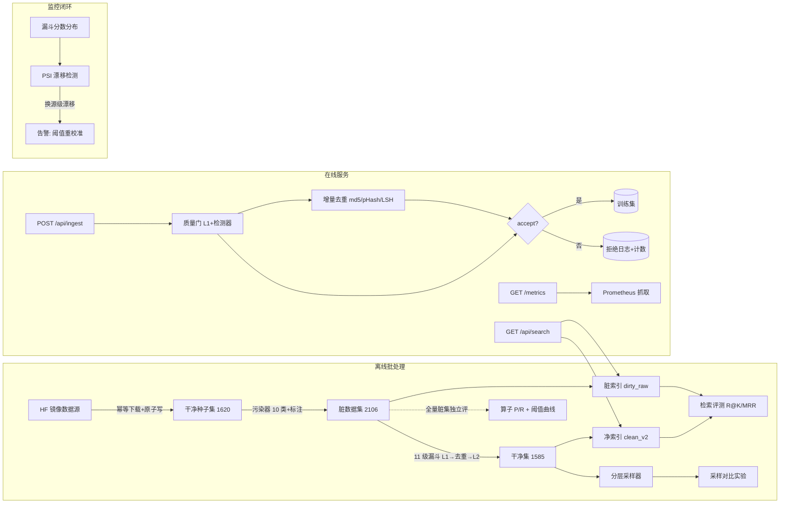

# 系统架构（含数据流与降级路径）

> 架构评审视角的完整视图：正常数据流 + 每个组件失效时的行为。
> 所有数字为实测（RTX 4060 / 1.6k 规模），规模扩展路径见各模块注释。

## 数据流与降级路径

## 分层与替换成本（依赖倒置的实测答案）

| 替换场景 | 改动范围 | 实证 |
|---|---|---|
| 换数据源（如 Kafka→Pulsar 类比） | 仅 `data/download.py` | **真实发生过**：justram parquet → ali-sh07，零行算子代码改动 |
| 换检索后端（FAISS→Milvus/IVF） | 仅 `index/store.py+searcher.py` | IndexFlatIP 已隔离；IVF 升级路径注释在 store.py |
| 换编码器（CLIP→SigLIP） | 仅 `embedding/clip_encoder.py` | 算子只依赖 encode_* 接口（FakeEncoder 测试即证据） |
| 换编排（Airflow→其他） | 仅 `dags/` | 任务=纯 CLI 命令，无框架耦合 |

## 故障模式与降级行为（FMEA 简表）

| 组件失效 | 系统行为 | 状态 |
|---|---|---|
| 检测器权重缺失 | 质量门降级运行（无 wm 分数），日志注明 | ✅ 已实现+测试 |
| 索引过期（上游重写） | searcher 告警但仍可查询；manifest.is_stale | ✅ 已实现 |
| 索引缺失/损坏 | /api/search 404；行数不一致拒载 | ✅ 已实现 |
| 上游数据源变更 | PSI 漂移告警（换源级）；渗透级靠算子 P/R 抽检 | ✅ 对照实验 |
| **ingest 去重状态重启丢失** | ~~内存态~~ journal 追加持久化，启动重放重建三层索引（崩溃半行容忍） | ✅ 已修复（`MM_DEDUP_JOURNAL` 可覆盖路径）；多进程并发仍需文件锁/外置存储 |
| GPU 不可用 | 全链路自动回落 CPU（编码/推理变慢，功能不变） | ✅ 自动 |

## 规模悬崖（10x 预判）

| 组件 | 当前复杂度 | 悬崖位置 | 升级路径 |
|---|---|---|---|
| phash_near / 去污染图像比对 | O(n²) 海明 | ~50k | 分桶或 FAISS 二值索引 |
| semantic_dedup | O(n²) 点积 | ~100k | FAISS IVF（store.py 注释） |
| IncrementalDedup.pHash | O(n) 线扫/条 | ~100k | 分桶哈希表 |
| IndexFlatIP 检索 | 精确 | ~1M | IVF/HNSW（接口不变） |
